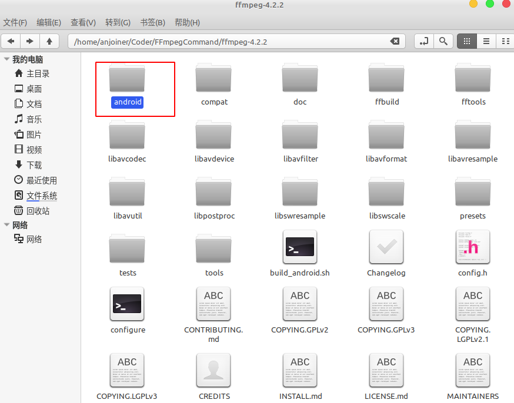
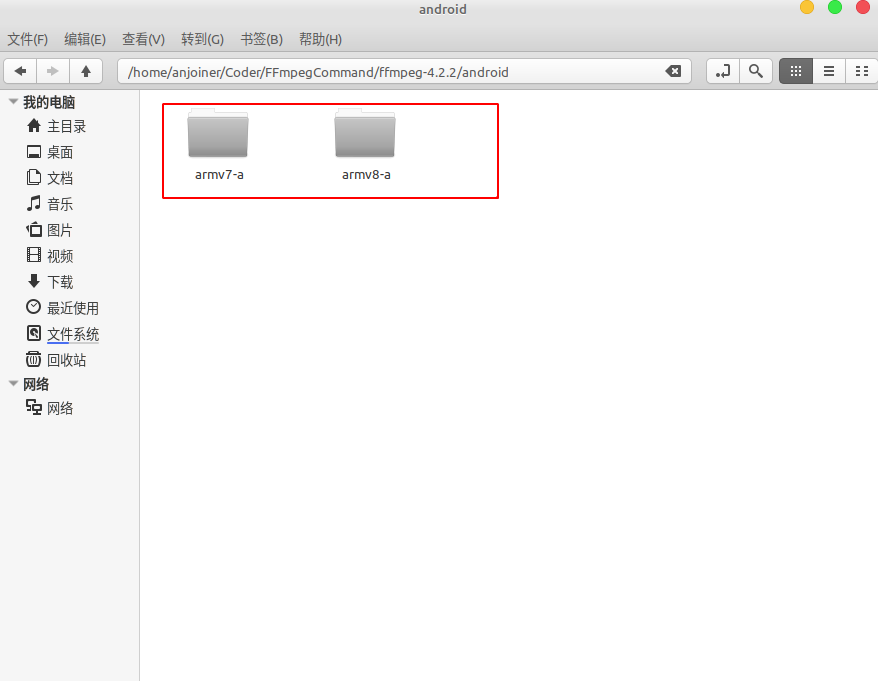
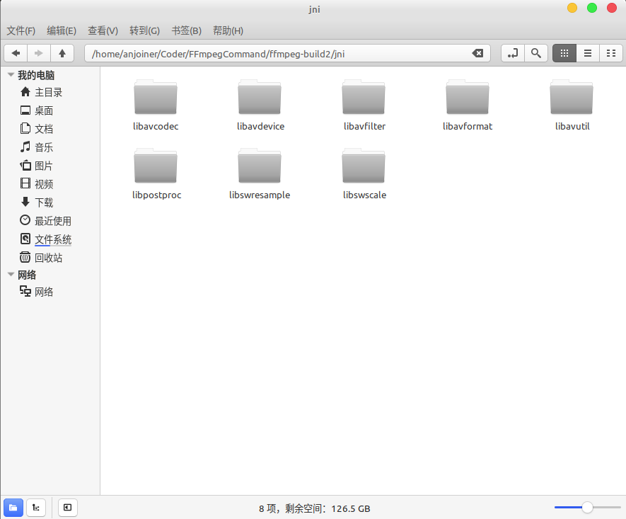
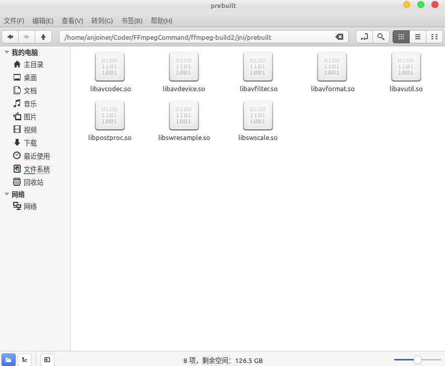
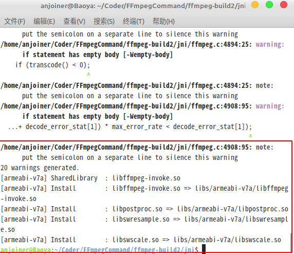

1. Edit the `configure` in ffmpeg-4.2.2

replace
```
SLIBNAME_WITH_MAJOR='$(SLIBNAME).$(LIBMAJOR)'
LIB_INSTALL_EXTRA_CMD='$$(RANLIB) "$(LIBDIR)/$(LIBNAME)"'
SLIB_INSTALL_NAME='$(SLIBNAME_WITH_VERSION)'
SLIB_INSTALL_LINKS='$(SLIBNAME_WITH_MAJOR) $(SLIBNAME)'
```
with
```
SLIBNAME_WITH_MAJOR='$(SLIBPREF)$(FULLNAME)-$(LIBMAJOR)$(SLIBSUF)'
LIB_INSTALL_EXTRA_CMD='$$(RANLIB)"$(LIBDIR)/$(LIBNAME)"'
SLIB_INSTALL_NAME='$(SLIBNAME_WITH_MAJOR)'
SLIB_INSTALL_LINKS='$(SLIBNAME)'
```

2. New the `build_android.sh` in fmpeg-4.2.2 and edit it

```
#!/bin/bash
# 清空上次的编译
make clean
#你自己的NDK路径.
NDK=/home/anjoiner/Android/Sdk/ndk-bundle
TOOLCHAIN=$NDK/toolchains/llvm/prebuilt/linux-x86_64
SYSROOT=$TOOLCHAIN/sysroot
API=21

function build_android
{
echo "Compiling FFmpeg for $CPU"
./configure \
    --prefix=$PREFIX \
    --disable-static \
    --disable-doc \
    --disable-ffmpeg \
    --disable-ffplay \
    --disable-ffprobe \
    --disable-doc \
    --disable-symver \
    --enable-nonfree \
    --enable-gpl \
    --enable-small \
    --enable-neon \
    --enable-hwaccels \
    --enable-avdevice \
    --enable-postproc \
    --enable-shared \
    --enable-jni \
    --enable-mediacodec \
    --enable-decoder=h264_mediacodec \
    --cross-prefix=$CROSS_PREFIX \
    --target-os=android \
    --arch=$ARCH \
    --cpu=$CPU \
    --nm=$NM \
    --strip=$STRIP \
    --cc=$CC \
    --cxx=$CXX \
    --enable-cross-compile \
    --sysroot=$SYSROOT \
    --extra-cflags="-Os -fpic $OPTIMIZE_CFLAGS" \
    --extra-ldflags="$ADDI_LDFLAGS" \
    $ADDITIONAL_CONFIGURE_FLAG
make clean
make
make install
echo "The Compilation of FFmpeg for $CPU is completed"
}

#armv8-a
ARCH=aarch64-linux-android-
VERSION=arm64
CPU=armv8-a
CROSS_PREFIX=$TOOLCHAIN/bin/${ARCH}
CC=$TOOLCHAIN/bin/aarch64-linux-android$API-clang
CXX=$TOOLCHAIN/bin/aarch64-linux-android$API-clang++
NM=$TOOLCHAIN/bin/${ARCH}nm
STRIP=$TOOLCHAIN/bin/${ARCH}strip
PREFIX=$(pwd)/android/$CPU
OPTIMIZE_CFLAGS="-march=$CPU"
build_android

#armv7-a
ARCH=arm-linux-androideabi-
VERSION=arm
CPU=armv7-a
CROSS_PREFIX=$TOOLCHAIN/bin/${ARCH}
CC=$TOOLCHAIN/bin/armv7a-linux-androideabi$API-clang
CXX=$TOOLCHAIN/bin/armv7a-linux-androideabi$API-clang++
NM=$TOOLCHAIN/bin/${ARCH}nm
STRIP=$TOOLCHAIN/bin/${ARCH}strip
PREFIX=$(pwd)/android/$CPU
OPTIMIZE_CFLAGS="-mfloat-abi=softfp -mfpu=neon -march=$CPU"
build_android
```

3. Give executable permissions to build_android.sh

```
sudo chmod +x build_android.sh
```

4. Start build

```
./build_android.sh
```

5. Then, you can get it





6. Creat a `jni` dir in anywhere and copy all dirs from `ffmeg-4.2.2/android/armv7-a/include` into `jni`



7. Create a `prebuilt` dir in `jni` and copy all xxx.so files from  `ffmpeg-4.2.2/android/armv7-a/lib` into `prebuilt`



8. Copy the following files from `ffmpeg-4.2.2/fftools` into `jni`

* cmdutils.c
* cmdutils.h
* ffmpeg_filter.c
* ffmpeg_hw.c
* ffmpeg_opt.c
* ffmpeg.c
* ffmpeg.h

9. Copy the following `config.h` from `ffmpeg-4.2.2` into `jni`

10. Edit `ffmpeg.c` 

* change `int main(int argc, char **argv)` to `int run(int argc, char **argv)`		
* append following code before `return` 
```c
nb_filtergraphs = 0;
nb_output_files = 0;
nb_output_streams = 0;
nb_input_files = 0;
nb_input_streams = 0;
```

11. Hidden function of `exit_program`
```c
int run(int argc, char **argv)
{
    int i, ret;
    BenchmarkTimeStamps ti;

    init_dynload();

    register_exit(ffmpeg_cleanup);

    setvbuf(stderr,NULL,_IONBF,0); /* win32 runtime needs this */

    av_log_set_flags(AV_LOG_SKIP_REPEATED);
    parse_loglevel(argc, argv, options);

    if(argc>1 && !strcmp(argv[1], "-d")){
        run_as_daemon=1;
        av_log_set_callback(log_callback_null);
        argc--;
        argv++;
    }

#if CONFIG_AVDEVICE
    avdevice_register_all();
#endif
    avformat_network_init();

    show_banner(argc, argv, options);

    /* parse options and open all input/output files */
    ret = ffmpeg_parse_options(argc, argv);
    if (ret < 0);
        // exit_program(1);

    if (nb_output_files <= 0 && nb_input_files == 0) {
        show_usage();
        av_log(NULL, AV_LOG_WARNING, "Use -h to get full help or, even better, run 'man %s'\n", program_name);
        // exit_program(1);
    }

    /* file converter / grab */
    if (nb_output_files <= 0) {
        av_log(NULL, AV_LOG_FATAL, "At least one output file must be specified\n");
        // exit_program(1);
    }

    for (i = 0; i < nb_output_files; i++) {
        if (strcmp(output_files[i]->ctx->oformat->name, "rtp"))
            want_sdp = 0;
    }

    current_time = ti = get_benchmark_time_stamps();
    if (transcode() < 0);
        // exit_program(1);
    if (do_benchmark) {
        int64_t utime, stime, rtime;
        current_time = get_benchmark_time_stamps();
        utime = current_time.user_usec - ti.user_usec;
        stime = current_time.sys_usec  - ti.sys_usec;
        rtime = current_time.real_usec - ti.real_usec;
        av_log(NULL, AV_LOG_INFO,
               "bench: utime=%0.3fs stime=%0.3fs rtime=%0.3fs\n",
               utime / 1000000.0, stime / 1000000.0, rtime / 1000000.0);
    }
    av_log(NULL, AV_LOG_DEBUG, "%"PRIu64" frames successfully decoded, %"PRIu64" decoding errors\n",
           decode_error_stat[0], decode_error_stat[1]);
    if ((decode_error_stat[0] + decode_error_stat[1]) * max_error_rate < decode_error_stat[1]);
        // exit_program(69);

    // exit_program(received_nb_signals ? 255 : main_return_code);

    nb_filtergraphs = 0;
    nb_output_files = 0;
    nb_output_streams = 0;
    nb_input_files = 0;
    nb_input_streams = 0;
    return main_return_code;
}
```


12. Add `int int run(int argc, char **argv);` in `ffmpeg.h`

```c
...
int hw_device_setup_for_encode(OutputStream *ost);

int hwaccel_decode_init(AVCodecContext *avctx);
// add it
int run(int argc, char **argv);

#endif /* FFTOOLS_FFMPEG_H */
```

14. Edit `cmdutils.h`

replace `void show_help_children(const AVClass *class, int flags);` with `void show_help_children(const AVClass *clazz, int flags);`  


15. Create `ffmpeg-invoke.cpp` in `jni` And use your package name to replace `com_coder_ffmpeg` 

```
#include <jni.h>
#include <string.h>
#include "android/log.h"

#define LOGD(...) __android_log_print(ANDROID_LOG_DEBUG, "ffmpeg-invoke", __VA_ARGS__)

extern "C"{
#include "ffmpeg.h"
#include "libavcodec/jni.h"
}

extern "C"
JNIEXPORT jint JNICALL
Java_com_coder_ffmpeg_jni_FFmpegCmd_run(JNIEnv *env, jclass type, jint cmdLen,
                                             jobjectArray cmd) {
    //set java vm
    JavaVM *jvm = NULL;
    env->GetJavaVM(&jvm);
    av_jni_set_java_vm(jvm, NULL);

    char *argCmd[cmdLen] ;
    jstring buf[cmdLen];

    for (int i = 0; i < cmdLen; ++i) {
        buf[i] = static_cast<jstring>(env->GetObjectArrayElement(cmd, i));
        char *string = const_cast<char *>(env->GetStringUTFChars(buf[i], JNI_FALSE));
        argCmd[i] = string;
        LOGD("argCmd=%s",argCmd[i]);
    }

    int retCode = run(cmdLen, argCmd);
    LOGD("ffmpeg-invoke: retCode=%d",retCode);

    return retCode;

}
```

16. Create `Android.mk` in `jni` and change path of ffmpeg about `LOCAL_C_INCLUDES`
```
LOCAL_PATH := $(call my-dir)

include $(CLEAR_VARS)
LOCAL_MODULE :=  libavdevice
LOCAL_SRC_FILES := prebuilt/libavdevice.so
include $(PREBUILT_SHARED_LIBRARY)

include $(CLEAR_VARS)
LOCAL_MODULE :=  libavutil
LOCAL_SRC_FILES := prebuilt/libavutil.so
include $(PREBUILT_SHARED_LIBRARY)

include $(CLEAR_VARS)
LOCAL_MODULE :=  libswresample
LOCAL_SRC_FILES := prebuilt/libswresample.so
include $(PREBUILT_SHARED_LIBRARY)

include $(CLEAR_VARS)
LOCAL_MODULE :=  libswscale
LOCAL_SRC_FILES := prebuilt/libswscale.so
include $(PREBUILT_SHARED_LIBRARY)

include $(CLEAR_VARS)
LOCAL_MODULE := libavcodec
LOCAL_SRC_FILES := prebuilt/libavcodec.so
include $(PREBUILT_SHARED_LIBRARY)

include $(CLEAR_VARS)
LOCAL_MODULE := libavformat
LOCAL_SRC_FILES := prebuilt/libavformat.so
include $(PREBUILT_SHARED_LIBRARY)

include $(CLEAR_VARS)
LOCAL_MODULE := libavfilter
LOCAL_SRC_FILES := prebuilt/libavfilter.so
include $(PREBUILT_SHARED_LIBRARY)

include $(CLEAR_VARS)
LOCAL_MODULE := libpostproc
LOCAL_SRC_FILES := prebuilt/libpostproc.so
include $(PREBUILT_SHARED_LIBRARY)


include $(CLEAR_VARS)
LOCAL_MODULE := ffmpeg-invoke

LOCAL_SRC_FILES :=ffmpeg-invoke.cpp \
                 cmdutils.c \
                 ffmpeg_filter.c \
                 ffmpeg_opt.c \
                 ffmpeg_hw.c \
                 ffmpeg.c

# change path of ffmpeg
LOCAL_C_INCLUDES := /home/anjoiner/Coder/FFmpegCommand/ffmpeg-4.2.2

LOCAL_LDLIBS := -llog -ljnigraphics -lz -landroid -lm -pthread -L$(SYSROOT)/usr/lib
LOCAL_SHARED_LIBRARIES := libavdevice libavcodec libavfilter libavformat libavutil libswresample libswscale libpostproc

include $(BUILD_SHARED_LIBRARY)
```

17. Create `Application.mk` in `jni`

```
APP_ABI := armeabi-v7a
APP_PLATFORM := android-21
APP_OPTIM := release
APP_STL := c++_static
```

18. Execute `ndk-build` command in `jni`
```
/home/anjoiner/Android/Sdk/ndk-bundle/ndk-build
```

19. If the following errors occur

```
/home/anjoiner/Coder/FFmpegCommand/ffmpeg-build2/jni/cmdutils.h:640:39: error: 
      invalid suffix on literal; C++11 requires a space between literal and
      identifier [-Wreserved-user-defined-literal]
    snprintf(name, sizeof(name), "0x%"PRIx64, ch_layout);

```

Edit the `cmdutils.h`

replace 
```
snprintf(name, sizeof(name), "0x%"PRIx64, ch_layout);
```
with
```
snprintf(name, sizeof(name), "0x%" PRIx64, ch_layout);
```

20. Execute `ndk-build` command in `jni` again 

