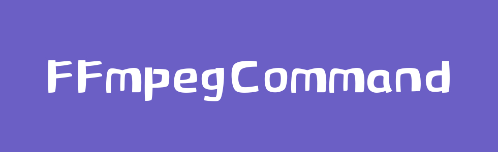
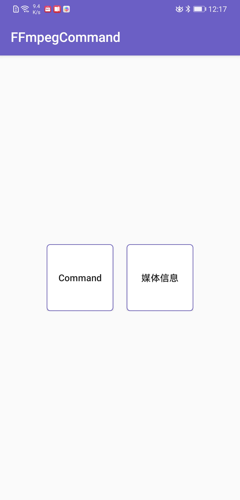
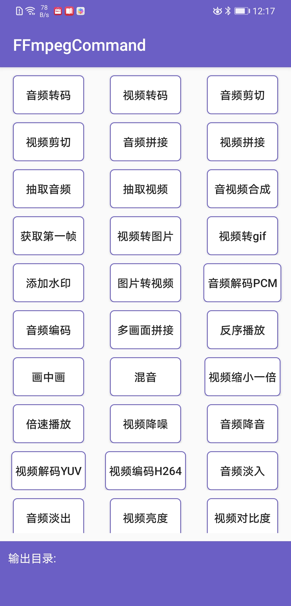
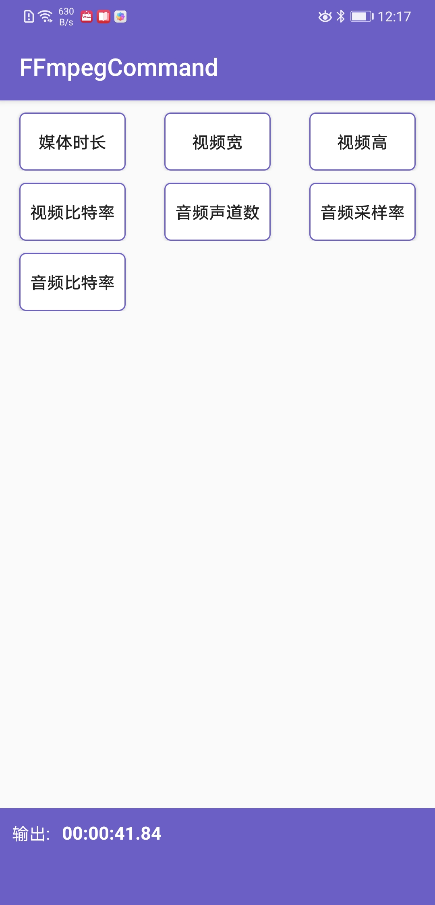

## 前景提要
在我们的开发中，经常会用到音视频相关内容，一般我们都会选择`FFmpeg`，但是其交叉编译对于我们来说是一件很麻烦的事情．所以这里方便日后使用，集成了关于`FFmpeg`相关库(mp3lame+libx264+fdk-aac),话不多说，请往下看～～

## 主要功能
[  ](https://bintray.com/sourfeng/repositories/ffmpeg/_latestVersion)[](https://www.apache.org/licenses/LICENSE-2.0)[ ](https://ffmpeg.org/releases/ffmpeg-4.2.1.tar.bz2)[ ](http://download.videolan.org/pub/videolan/x264/snapshots/x264-snapshot-20191217-2245-stable.tar.bz2)[ ](https://sourceforge.net/projects/lame/files/latest/download)[ ](https://downloads.sourceforge.net/opencore-amr/fdk-aac-2.0.1.tar.gz)

* **支持所有FFmpeg命令**
* **支持视频格式转换 mp4->flv**
* **支持音频编解码 mp3->pcm pcm->mp3 pcm->aac**
* **支持视频编解码 mp4->yuv yuv->h264**
* **支持音视频的剪切、拼接**
* **支持视频转图片 mp4->png mp4->gif**
* **支持音频声音大小控制以及混音（比如朗读的声音加上背景音乐）**
* **支持部分滤镜 音频淡入、淡出效果、视频亮度和对比度以及添加水印**
* **支持获取媒体文件信息**

|展示|执行FFmpeg命令|获取媒体信息|
|---------| ----------------------------------| --------- |
||||


## 引入

根据最新版本替换下面的`latestVersion`，当前最新版本[  ](https://bintray.com/sourfeng/repositories/ffmpeg/_latestVersion)

```groovy
implementation 'com.coder.command:ffmpeg:${latestVersion}'
```

## 使用

下面只展示部分使用，其他可以参考[【WIKI】](https://github.com/AnJoiner/FFmpegCommand/wiki)

### FFmpegCommand方法
```java
FFmpegCommand->runSync(final String[] cmd)  // 同步执行ffmpeg命令，外部需添加延时线程      
FFmpegCommand->runSync(final String[] cmd, FFmpegCmd.OnFFmpegProgressListener listener)//同步执行ffmpeg命令，并返回进度   
FFmpegCommand->runAsync(final String[] cmd, final ICallBack callBack)//异步执行，外部无需添加延时线程     
FFmpegCommand->getInfoSync(String path,@Attribute int type)//获取媒体信息，type值必须为`@Attribute`中注解参数   
```

### 使用runAsync
直接调用`FFmpegCommand.runAsync(String[] cmd, ICallBack callback)`方法，其中第一个参数由`FFmpegUtils`工具类提供，也可以自己添加     
```java
final long startTime = System.currentTimeMillis();
String input =Environment.getExternalStorageDirectory().getPath() + File.separator +
                        "DCIM" + File.separator + "test.mp3";
String output =Environment.getExternalStorageDirectory().getPath() + File.separator +
                        "DCIM" + File.separator + "output.mp3";

FFmpegCommand.runAsync(FFmpegUtils.cutAudio(input, "00:00:30", "00:00:40",
     output), new CommonCallBack() {
     @Override
     public void onComplete() {
         Log.d("FFmpegTest", "run: 耗时：" + (System.currentTimeMillis() - startTime));
     }
});

```
### 自定义FFmpeg命令

这里只是演示了音频剪切，很多如上述功能请自行查阅[FFmpegUtils](https://github.com/AnJoiner/FFmpegCommand/blob/master/ffmpeg/src/main/java/com/coder/ffmpeg/utils/FFmpegUtils.java)
如果其中不满足需求，可添加自己的FFmpeg命令．例如：

```java
String cmd = "ffmpeg -y -i %s -vn -acodec copy -ss %s -t %s %s";
String result = String.format(cmd, input, "00:00:30", "00:00:40", output);
FFmpegCommand.runAsync(result.split(" "), new CommonCallBack() {
     @Override
     public void onComplete() {
         Log.d("FFmpegTest", "run: 耗时：" + (System.currentTimeMillis() - startTime));
     }
})
```

**[【其他方法】](https://github.com/AnJoiner/FFmpegCommand/wiki)**

**[【功能详解】](https://github.com/AnJoiner/FFmpegCommand/wiki/%E8%AF%A6%E7%BB%86%E5%8A%9F%E8%83%BD)**

**[【常见问题】](https://github.com/AnJoiner/FFmpegCommand/wiki/%E5%B8%B8%E8%A7%81%E9%97%AE%E9%A2%98)**

## 参考

* Java 使用请参考 [FFmpegCommandActivity](app/src/main/java/com/coder/ffmpegtest/ui/FFmpegCommandActivity.java)
* Kotlin使用请参考 [KFFmpegCommandActivity](app/src/main/java/com/coder/ffmpegtest/ui/KFFmpegCommandActivity.kt)

## 自定义解码器

因为引入了`LAME`，我们其实可以使用它自定义音频编码器，将其编译成so文件提供使用，具体参考[【WIKI-自定义MP3编码器】](https://github.com/AnJoiner/FFmpegCommand/wiki/%E8%87%AA%E5%AE%9A%E4%B9%89MP3%E7%BC%96%E7%A0%81%E5%99%A8)

## 体验交流

| 扫码下载｜[点击下载](https://raw.githubusercontent.com/AnJoiner/FFmpegCommand/master/app/release/app-release.apk)  | 交流|
| :--------:   |:--------:   |
| |   |

## License
```
Copyright 2019 AnJoiner

Licensed under the Apache License, Version 2.0 (the "License");
you may not use this file except in compliance with the License.
You may obtain a copy of the License at

     http://www.apache.org/licenses/LICENSE-2.0

Unless required by applicable law or agreed to in writing, software
distributed under the License is distributed on an "AS IS" BASIS,
WITHOUT WARRANTIES OR CONDITIONS OF ANY KIND, either express or implied.
See the License for the specific language governing permissions and
limitations under the License.
```
