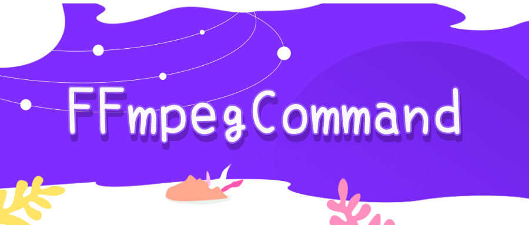
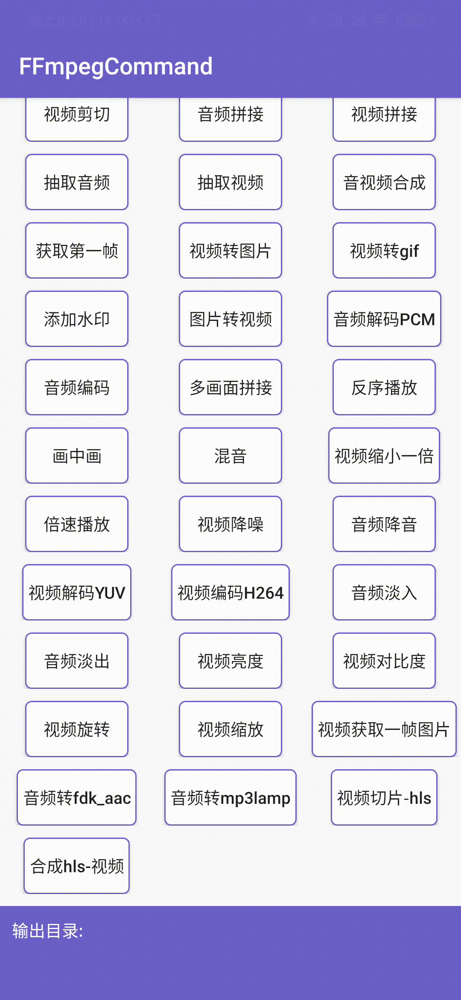
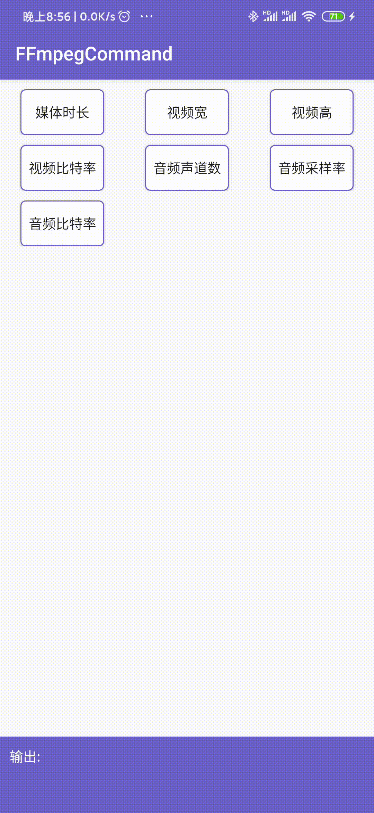
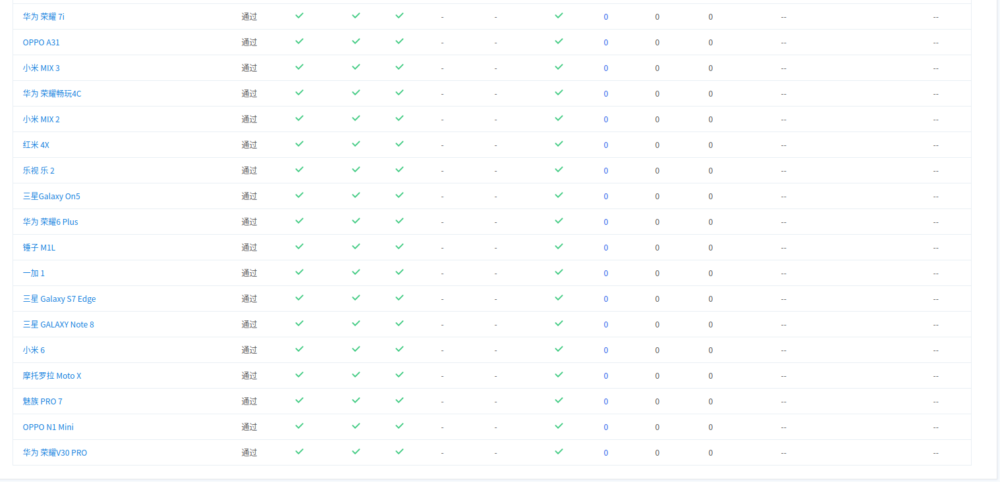
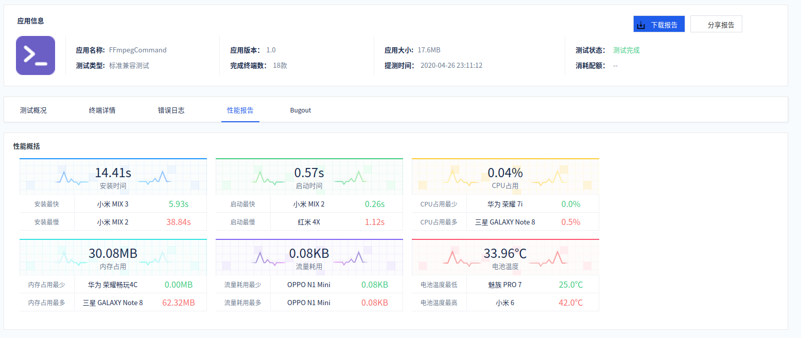
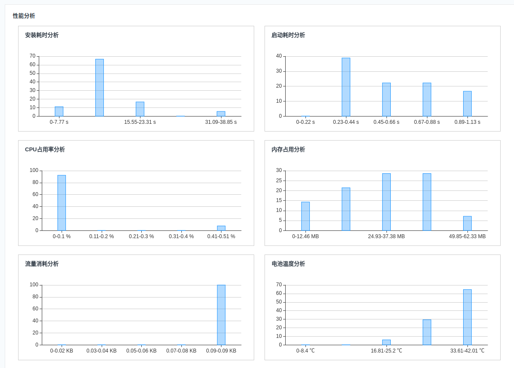

## 前景提要
在我们的开发中，经常会用到音视频相关内容，一般我们都会选择[FFmpeg](https://www.ffmpeg.org/)，但是其交叉编译对于我们来说是一件很麻烦的事情．所以这里方便日后使用就编写了这个`FFmpegCommand`，`FFmpegCommand`是由`FFmpeg`核心库，并且集成了`lame`、`libx264`和`fdk-aac`主流音视频处理程序构成的Android程序

**注意：当前库只适用于Android**

## 主要功能
[  ](https://bintray.com/sourfeng/repositories/ffmpeg/_latestVersion)[](https://www.apache.org/licenses/LICENSE-2.0)[ ](https://ffmpeg.org/releases/ffmpeg-4.2.1.tar.bz2)[ ](http://download.videolan.org/pub/videolan/x264/snapshots/x264-snapshot-20191217-2245-stable.tar.bz2)[ ](https://sourceforge.net/projects/lame/files/latest/download)[ ](https://downloads.sourceforge.net/opencore-amr/fdk-aac-2.0.1.tar.gz)

* **支持所有FFmpeg命令**
* **支持视频格式转换 mp4->flv**
* **支持音频编解码 mp3->pcm pcm->mp3 pcm->aac**
* **支持视频编解码 mp4->yuv yuv->h264**
* **支持音视频的剪切、拼接**
* **支持视频转图片 mp4->png mp4->gif**
* **支持音频声音大小控制以及混音（比如朗读的声音加上背景音乐）**
* **支持部分滤镜 音频淡入、淡出效果、视频亮度和对比度以及添加水印**
* **支持获取媒体文件信息**
* **支持多命令同步/异步执行**

|执行FFmpeg|获取媒体信息|
|---------| ----------------------------------| 
|||


## 引入

下面两种引入只选择一种即可,并根据最新版本替换下面的`latestVersion`，当前最新版本[  ](https://bintray.com/sourfeng/repositories/ffmpeg/_latestVersion)

```groovy
// 全部编解码-体积较大
implementation 'com.coder.command:ffmpeg:${latestVersion}'
// 部分常用编解码-体积较小,比上面引入减少大约6M
implementation 'com.coder.command:ffmpeg-mini:${latestVersion}'
```

**如果没有特别的编解码需求,强烈推荐建议使用`ffmpeg-mini`**

## 使用

下面只展示部分使用，其他可以参考 **[【WIKI】](wiki/Home)**

### FFmpegCommand方法

|方法 |功能 |加入版本 |
|:---|----|----|
|FFmpegCommand->setDebug(boolean debug)|Dubug模式，可打印日志，默认true|1.1.1 |
|FFmpegCommand->runSync(final String[] cmd)|同步执行ffmpeg命令，外部需添加延时线程|1.1.1 |
|FFmpegCommand->runSync(final String[] cmd, OnFFmpegCommandListener listener)|同步执行ffmpeg命令，并回调 完成，取消，进度|1.1.3 |
|FFmpegCommand->runAsync(final String[] cmd, IFFmpegCallBack callBack)|异步执行，外部无需添加延时线程，并回调 开始，完成，取消，进度|1.1.3 |
|FFmpegCommand->getInfoSync(String path,@Attribute int type)|获取媒体信息，type值必须为`@Attribute`中注解参数|1.1.1 |
|FFmpegCommand->cancel()| 退出当前ffmpeg执行 |1.1.3 |
|FFmpegCommand->runMoreSync(List<String[]> cmds, OnFFmpegCommandListener listener)|同步多命令执行，并回调 完成，取消，进度|1.1.5 |
|FFmpegCommand->runMoreAsync(List<String[]> cmds, IFFmpegCallBack callBack)|同步多命令执行，并回调开始，完成，取消，进度|1.1.5 |

### 使用runAsync
以`runAsync`调用`FFmpeg`为异步方式，不需要单独开启子线程。强烈建议使用此方法进行音视频处理!!!   
直接调用`FFmpegCommand.runAsync(String[] cmd, IFFmpegCallBack callback)`方法，其中第一个参数由`FFmpegUtils`工具类提供，也可以自己添加

```java

final long startTime = System.currentTimeMillis();

FFmpegCommand.runAsync(FFmpegUtils.cutAudio(input, "00:00:30", "00:00:40", output),
    new CommonCallBack() {
         @Override
         public void onComplete() {
         Log.d("FFmpegTest", "run: 耗时：" + (System.currentTimeMillis() - startTime));

         @Override
         public void onCancel() {
             Log.d("FFmpegTest", "Cancel");
         }

         @Override
         public void onProgress(int progress) {
             Log.d("FFmpegTest",progress+"");
         }
    }
});

```
### 自定义FFmpeg命令

这里只是演示了音频剪切，很多如上述功能请自行查阅[FFmpegUtils](https://github.com/AnJoiner/FFmpegCommand/blob/master/ffmpeg/src/main/java/com/coder/ffmpeg/utils/FFmpegUtils.java)
如果其中不满足需求，可添加自己的FFmpeg命令．例如：

```java
String cmd = "ffmpeg -y -i %s -vn -acodec copy -ss %s -t %s %s";
String result = String.format(cmd, input, "00:00:30", "00:00:40", output);

FFmpegCommand.runAsync(result.split(" "), new CommonCallBack() {
     @Override
     public void onComplete() {
         Log.d("FFmpegTest", "run: 耗时：" + (System.currentTimeMillis() - startTime));
     }

     @Override
     public void onCancel() {
         Log.d("FFmpegTest", "Cancel");
     }

     @Override
     public void onProgress(int progress) {
         Log.d("FFmpegTest",progress+"");
     }
})
```

### 多命令执行

在`1.1.5`版本新增了多命令执行方式，可以多条命令一同执行，可返回总进度，提供了两种方式去实现

* **runMoreSync** 多条命令同步执行
* **runMoreAsync** 多条命令异步执行

```kotlin
FFmpegCommand.runMoreAsync(st, object : CommonCallBack() {
    override fun onStart() {
        mErrorDialog?.show(supportFragmentManager, "Dialog")
    }

    override fun onComplete() {
        mErrorDialog?.setContent(0)
        mErrorDialog?.dismissAllowingStateLoss()
        ToastUtils.show("多命令执行完成")
        val target = targetAAC + "\n" + targetAVI + "\n" + targetYUV
        tvContent!!.text = target
    }

    override fun onCancel() {
        ToastUtils.show("用户取消")
    }

    override fun onProgress(progress: Int) {
        mErrorDialog?.setContent(progress)
    }
})
```

需要注意的是：

在`1.1.5`版本之后可以使用**多条同步命令**进行执行，但**不可**同时使用**多条异步命令**

```kotlin
Thread(Runnable {
	FFmpegCommand.runSync(FFmpegUtils.transformAudio(audioPath, targetPath), object : FFmpegCommand.OnFFmpegCommandListener{})
	FFmpegCommand.runSync(FFmpegUtils.decode2YUV(mVideoPath, targetPath), object : FFmpegCommand.OnFFmpegCommandListener{})
  FFmpegCommand.runSync(FFmpegUtils.transformVideo(videoPath, targetPath), object : FFmpegCommand.OnFFmpegCommandListener())
}).start()
```


### 取消执行
执行下面方法后将会回调 `CommonCallBack->onCancel()` 或 `OnFFmpegCommandListener->onCancel()` 方法

```java
FFmpegCommand.cancel();
```

**[【其他方法】](wiki/使用)**

**[【功能详解】](wiki/详细功能)**

**[【常见问题】](wiki/常见问题)**

**[【版本更新】](UPDATE.md)**

## 参考
**[【KFFmpegCommandActivity】](app/src/main/java/com/coder/ffmpegtest/ui/KFFmpegCommandActivity.kt)**
**[【KFFmpegMoreCommandActivity】](app/src/main/java/com/coder/ffmpegtest/ui/KFFmpegMoreCommandActivity.kt)**
**[【KFFmpegInfoActivity】](app/src/main/java/com/coder/ffmpegtest/ui/KFFmpegInfoActivity.kt)**

## 兼容性
兼容Android minSdkVersion >=14（version>=1.1.4，此前的版本只兼容minSdkVersion >=21）





## 自定义编码器

因为引入了`LAME`，我们其实可以使用它自定义音频编码器，将其编译成so文件提供使用，具体参考[【WIKI-自定义MP3编码器】](https://github.com/AnJoiner/FFmpegCommand/wiki/%E8%87%AA%E5%AE%9A%E4%B9%89MP3%E7%BC%96%E7%A0%81%E5%99%A8)

## 体验交流

| 扫码下载｜[点击下载](http://fir.readdown.com/nfyz)  | 交流|微信赞赏|
| :--------:   |:--------:   |:--------:   |
| |   | |

## Start

如果觉得对你有所帮助，给个Start支持一下吧，也欢迎多多fork！

## 混淆

```
-keep class com.coder.ffmpeg.** {*;}
-dontwarn  com.coder.ffmpeg.**
```

## License
```
Copyright 2019 AnJoiner

Licensed under the Apache License, Version 2.0 (the "License");
you may not use this file except in compliance with the License.
You may obtain a copy of the License at

     http://www.apache.org/licenses/LICENSE-2.0

Unless required by applicable law or agreed to in writing, software
distributed under the License is distributed on an "AS IS" BASIS,
WITHOUT WARRANTIES OR CONDITIONS OF ANY KIND, either express or implied.
See the License for the specific language governing permissions and
limitations under the License.
```
